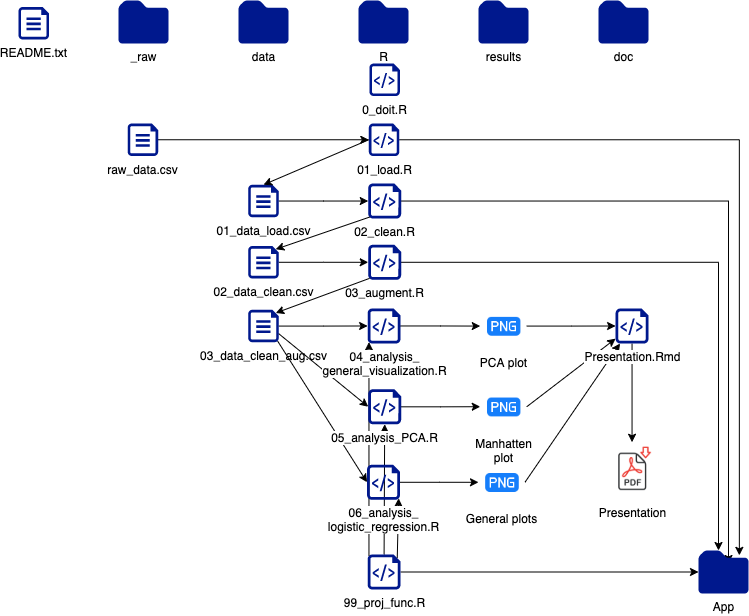

```{r setup, include=FALSE}
knitr::opts_chunk$set(echo = FALSE)
```

```{r include = FALSE}
#source(file = "/cloud/project/R/00_doit.R",local = FALSE)
```

## Introduction to the Dataset
<div style="float: left; width: 85%;">
### The Dataset
-   Real Breast Cancer Data
-   [Source](https://www.kaggle.com/code/varshinipj/breast-cancer-gene-data/data)
-   Raw dataset has 341 observations and 16 variables
-   Clean dataset has 307 observations and 14 variables
-   Augmented dataset has 307 observations and 16 variables

### Removed
-   Variables with no Patient Status
-   Columns with only one unique variable
-   Date of last visit in the future
</div>

<div style="float: left; width: 15%;">
```{r breast cancer, echo=FALSE, out.width='125px', out.height='125px', fig.align = 'left' }
knitr::include_graphics("/cloud/project/doc/breastcancer.png")
```
</div>

## Workflow
<div style="float: left; width: 40%;">
```{r workflow, echo=FALSE, out.width='250px', out.height='500px', fig.align= 'center'}
knitr::include_graphics("/cloud/project/doc/workflow.png")
```
</div>

<div style="float: left; width: 50%;">
```{r fileflow, echo=FALSE, out.width='550px', out.height='500px', fig.pos = 'center'}

```
</div>

## Materials and Methods

### Materials
- The Clean Dataset

### Methods
- Logistic Regression
- Principal Component Analysis


## Results

### Plot recreations
<!-- <div style="float: left; width: 1110%;"> -->
<!-- ```{r} -->
<!-- pr1 <- "/cloud/project/results/Plot_from_Kaggle_to_Recreate.png" -->

<!-- pr2 <- "/cloud/project/results/Plot_from_Kaggle_to_Recreate.png" -->

<!-- pr3 <- "/cloud/project/results/Plot_from_Kaggle_to_Recreate.png" -->

<!-- pr4 <- "/cloud/project/results/Plot_from_Kaggle_to_Recreate.png" -->

<!-- (pr1 + pr2) / (pr3 + pr4) -->
<!-- ``` -->


<!-- </div>  -->


## Results

### Data Visualization


## Results

### Logistic Regression
```{r}
models %>% 
  select(Protein,
         neglog10p,
         Significant) %>% 
  ggplot(data = .,
         mapping = aes(x = Protein,
                       y = neglog10p)) + 
  geom_point(mapping = aes(color = Significant),
             size = 2,
             alpha = 1) + 
  geom_hline(mapping = aes(yintercept = -log10(0.05)),
             color = "Black",
             alpha = 0.5,
             linetype = "dashed") + 
  geom_polygon(mapping = aes(x = c(0.4,0.4,4.6,4.6),
                             y = c(-log10(0.05),1.75,1.75,-log10(0.05))),
               fill = "Green",
               alpha = 0.1) +
  geom_polygon(mapping = aes(x = c(0.4,0.4,4.6,4.6),
                             y = c(-0,-log10(0.05),-log10(0.05),0)),
               fill = "Red",
               alpha = 0.1) +
  annotate(geom = "text",
           x = 1,
           y = 1.7,
           label = "Significant",
           size = 2,
           color = "Darkgreen") +
  annotate(geom = "text",
           x=1,
           y=1.25,
           label = "Insignificant",
           size = 2,
           color = "Darkred") +
  our_theme(legend_position = "bottom",
            x_angle = 45) +
  labs(x = "",
       y = "Negative log10 of p-value",
       title = "Manhattan plot")
```

## Results


### Principal Component Analysis
<div style="float: left; width: 1110%;">
```{r}
p1 <- pca_fit %>%
  tidy(matrix = "rotation") %>%
  pivot_wider(names_from = "PC",
              names_prefix = "PC",
              values_from = "value") %>%
  ggplot(aes(x = PC1,
             y = PC2)) +
  geom_segment(xend = 0,
               yend = 0,
               arrow = arrow_style) +
  geom_text(aes(label = column),
            hjust = 1,
            nudge_x = 0.15,
            nudge_y = 0.08,
            color = "#fb0100") +
  coord_fixed() +
  our_theme()

p2 <- pca_fit %>%
  tidy(matrix = "eigenvalues") %>%
  filter(PC <= 10) %>% 
  ggplot(aes(x = PC,
             y = percent)) +
  geom_col(fill = "#1f77b4",
           color = 'black') +
  scale_x_continuous(breaks = 1:10) +
  scale_y_continuous(labels = scales::percent_format(),
                     expand = expansion(mult = c(0, 0.01))) +
  our_theme() +
  labs(y = 'Percentage')

p1 + p2
```


</div> 


## Results

### Shiny Application
- Link
- Short demo


## Discussion
- Bad data
- No significant results from the dataset
- Large focus on app


