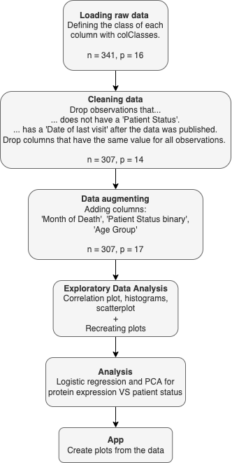

```{r setup, include=FALSE}
knitr::opts_chunk$set(echo = FALSE)
```

```{r}
source(file = "/cloud/project/R/00_doit.R",local = FALSE)
```

## Introduction to the Dataset
<div style="float: left; width: 85%;">
### The Dataset
-   Real Breast Cancer Data
-   [Source](https://www.kaggle.com/code/varshinipj/breast-cancer-gene-data/data)
-   Raw dataset has 341 observations and 16 variables
-   Clean dataset has 307 observations and 14 variables

### Removed
-   Variables with no Patient Status
-   Columns with only one unique variable
-   Date of last visit in the future
</div>

<div style="float: left; width: 15%;">
```{r breast cancer, echo=FALSE, out.width='125px', out.height='125px', fig.align = 'left' }
#
```
</div>

## Workflow
<div style="float: left; width: 40%;">
```{r workflow, echo=FALSE, out.width='250px', out.height='500px', fig.align= 'center'}
#
```
</div>

<div style="float: left; width: 50%;">
```{r fileflow, echo=FALSE, out.width='450px', out.height='500px', fig.pos = 'center'}
#knitr::include_graphics("./fileflow.png")
```
</div>

## Materials and Methods

### Materials
- The Clean Dataset

### Methods
- Logistic Regression
- Principal Component Analysis

## Results

### Data Vizulisation


### Logistic Regression
- LR plot


### Principal Component Analysis
- PCA plot

### Shiny Application
- Link

## Discussion
- No significant results from the dataset


